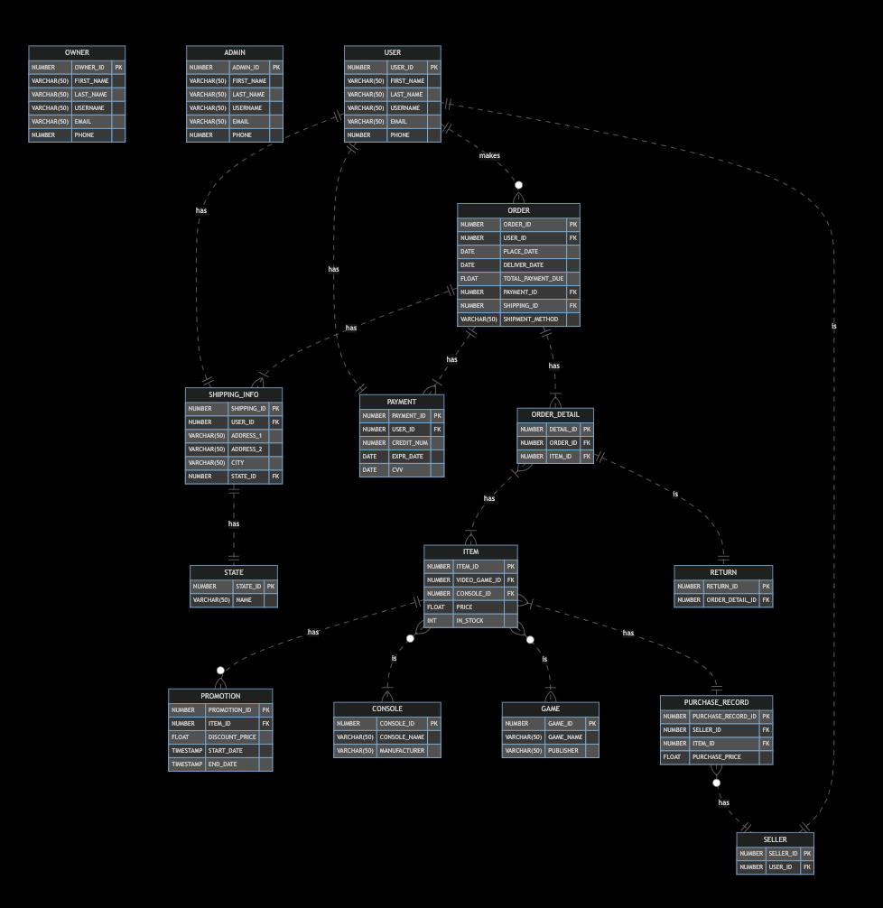

# Large-Scale-Database

This project is a large-scale database developed with Oracle. The database was created as a final project for my _Advanced Database Programming with Oracle_ class at IUPUI. The design of the database is centered around an online store that buys and sells retro video games and consoles. There are fifteen tables loaded with sample data, as well as several PL/SQL code blocks that execute database management and business operations. This project demonstrates many database programming skills such as PL/SQL basics, cursors, triggers, exception handling, procedures, and packages. The ER diagram of the fully normalized relational database is shown below:

## Scripts
The following scripts can be imported and ran on an Oracle database.

### All_Scripts.sql
Drops and creates all tables. Loads sample data into the tables. Runs all PL/SQL code blocks.

### Recreate_And_Load_Tables.sql
Only drops and creates all tables. Loads sample data into the tables.

### PL_SQL_Code_Blocks.sql
Runs all PL/SQL code blocks.

### Script_Output.txt
Outputs console logs from running PL_SQL_Code_Blocks.sql.
